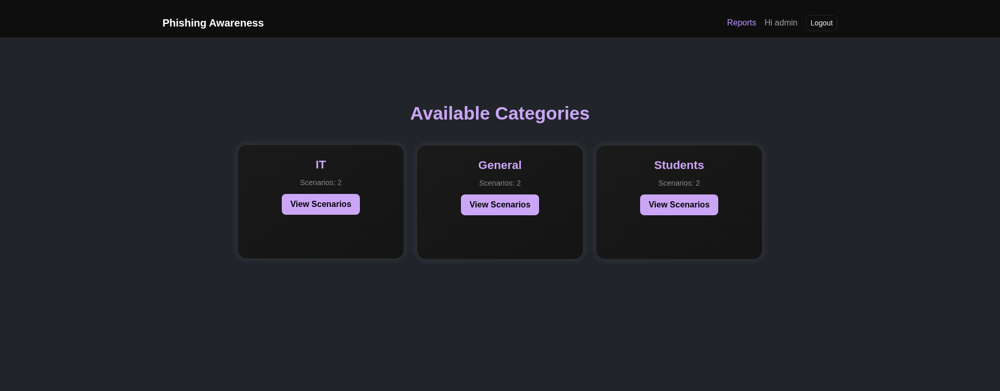
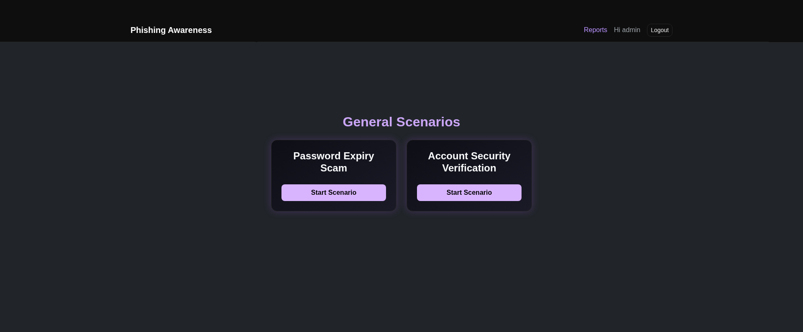

[](https://github.com/royy92/phishing-training-platform/actions/workflows/ci.yml)

# Phishing Training Platform (Django)

Phishing scenario training app featuring multiple scenarios, login/registration support, and an interactive reporting dashboard.

## Documentation

📖 View the project documentation:

https://royy92.github.io/phishing-training-platform/

## Platform





## Requirements

- Python 3.11+
- Django 6.x
- Tailwind CSS

## Run

```bash
python -m venv venv
source venv/bin/activate
pip install -r requirements.txt
python manage.py migrate
python manage.py createsuperuser
python manage.py runserver
```

## Verify the release signature

Download these release assets:

- `phishing-training-platform-v0.1.1.tar.gz`
- `phishing-training-platform-v0.1.1.tar.gz.sigstore.json`


Then run:

```bash
cosign verify-blob \
  --bundle phishing-training-platform-v0.1.1.tar.gz.sigstore.json \
  --certificate-identity \
    "https://github.com/royy92/phishing-training-platform/.github/workflows/release.yml@refs/tags/v0.1.1" \
  --certificate-oidc-issuer \
    "https://token.actions.githubusercontent.com" \
  phishing-training-platform-v0.1.1.tar.gz
```
